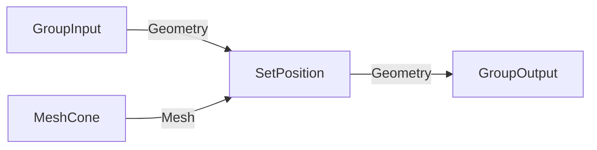

# Geometry Nodes MCP Workflow

This project provides tools for creating and validating Blender Geometry Nodes via Claude Code, ChatGPT Pro, RooCode, Cline, or any LLM tool with Blender MCP access.

## Quick Start

At the start of any geometry nodes session, load the portable toolkit:

```python
exec(open("/Users/alexanderporter/Documents/_DEV/Geo Nodes MCP/toolkit.py").read())
```

This loads all functions into Blender's Python environment.

## Workflow Options

### Option 1: Mermaid → Blender (Recommended for Complex Graphs)

Plan in Mermaid for the high-level flow (Group Input/Output, major branches), then build:

```python
mermaid_graph = '''
flowchart LR
  gi["GroupInput"] -->|Instance| n3["InstanceOnPoints"]
  n1["MeshGrid"] -->|Mesh| n2["MeshToPoints"]
  n2 -->|Points| n3
  n4["MeshCone"] -->|Mesh| n3
  n3 -->|Geometry| go["GroupOutput"]
'''

result = mermaid_to_blender("MyObject", "MyModifier", mermaid_graph,
    node_settings={"n1": {"Size X": 10}, "n4": {"Depth": 0.5}})
```

### Option 2: graph_json / Direct Scripting

Build from explicit JSON specification:

```python
graph_json = {
    "nodes": [
        {"id": "group_in", "type": "NodeGroupInput"},
        {"id": "grid", "type": "GeometryNodeMeshGrid"},
        {"id": "instance", "type": "GeometryNodeInstanceOnPoints"},
        {"id": "group_out", "type": "NodeGroupOutput"}
    ],
    "links": [
        {"from": "group_in", "from_socket": "Geometry", "to": "instance", "to_socket": "Instance"},
        {"from": "grid", "from_socket": "Mesh", "to": "instance", "to_socket": "Points"},
        {"from": "instance", "from_socket": "Instances", "to": "group_out", "to_socket": "Geometry"}
    ],
    "node_settings": {"grid": {"Size X": 10}}
}
result = build_graph_from_json("MyObject", "MyModifier", graph_json)
```

#### Incremental Merge Updates

When you need to update an existing node group without rebuilding from scratch,
use merge mode. The builder diffs the existing node tree by JSON node IDs,
creates missing nodes, updates settings, and rewires links. You can optionally
remove nodes/links that are not present in the JSON.

```python
merge_result = build_graph_from_json(
    "MyObject",
    "MyModifier",
    graph_json,
    merge_existing=True,
    remove_extras=True,
)

print(merge_result.get("diff_summary"))
```

Notes:
- `merge_existing=True` implies `clear_existing=False`.
- `remove_extras=True` only removes nodes/links (not interface sockets).
- The result includes `diff_summary` with created/updated/removed nodes and
  added/removed links.
- Random Value in Blender 5.0 emits fields by default. Set its data type to
  `FLOAT` (or capture the field) before wiring into Set Position Offset.

**Note:** For detailed subgraphs (asset modeling, curve networks), you may skip Mermaid and go straight to `graph_json` or scripted helpers. Mermaid shines for topology sketches but gets unwieldy for intricate procedural assets. Use whichever approach keeps the graph readable.

### Option 3: Incremental API (Recommended for LLMs)

The Incremental API provides imperative node building with immediate validation at each step. This is the recommended approach for LLM agents because:

- **Immediate feedback** — Each statement validates on execution, no need to debug entire JSON blobs
- **Auto-detection** — Socket connections are inferred by type, no need to memorize exact socket names
- **Aliases work** — Use "scatter" instead of "GeometryNodeDistributePointsOnFaces"
- **Settings inline** — Configure nodes at creation time with keyword arguments

```python
# Get node group from modifier
obj = bpy.data.objects["Cube"]
mod = obj.modifiers.new("Test", "NODES")
ng = mod.node_group

# Build nodes incrementally (aliases and labels work!)
grid = add_node(ng, "Grid", size_x=5, size_y=5)
points = add_node(ng, "scatter", density=10)      # "scatter" is an alias
cone = add_node(ng, "Cone", radius_bottom=0.3)
instance = add_node(ng, "Instance on Points")

# Link with auto-detection (finds compatible sockets automatically)
auto_link(ng, grid, points)                       # Mesh → Mesh
auto_link(ng, points, instance)                   # Points → Points
auto_link(ng, cone, instance, "Instance")         # Explicit: Mesh → Instance socket

# Connect to output
connect_to_output(ng, instance)

# Layout for visual clarity
layout_nodes(ng)
```

**Node Resolution:** `resolve_node_type()` accepts:
- Full identifiers: `"GeometryNodeMeshCone"`
- Labels: `"Mesh Cone"`, `"Set Position"`
- Labels without spaces: `"MeshCone"`, `"SetPosition"`
- Aliases: `"scatter"`, `"instance"`, `"box"`, `"random"`, etc.

**Common Aliases:** scatter, instance, box, plane, sphere, random, math, mix, remap, extrude, subdivide, boolean, join, transform, raycast, position, index, normal

**Build → Describe → Adjust Loop:** Use `describe_node_group()` to inspect the current state after each change:

```python
# Build incrementally
grid = add_node(ng, "Grid", size_x=5)
points = add_node(ng, "scatter")

# Check state — what's missing?
state = describe_node_group(ng)
print(f"Output connected: {state['has_output']}")  # False
for warn in state["warnings"]:
    print(f"  Fix: {warn}")

# Link and check again
auto_link(ng, grid, points)
connect_to_output(ng, points)

state = describe_node_group(ng)
print(f"Output connected: {state['has_output']}")  # True
print(f"Warnings: {len(state['warnings'])}")       # 0

# Or use the pretty-print helper
print_node_group_state(ng)
```

**Two-loop cadence:** Stay in the **build loop** (add_node → auto_link → describe_node_group/print_node_group_state) until the snapshot shows no warnings and all required geometry inputs/output are connected. Then switch to the **evaluation loop**: run the MCP validation payload (or `full_geo_nodes_validation()`), capture screenshots/metrics, and log results. If validation uncovers issues, drop back into the build loop, fix them, and re-run evaluation.

This tight feedback loop lets LLMs fix issues one at a time without running expensive full validation.

### Debugging Playbook (When Things Go Wrong)

1. **Snapshot first:** Call `describe_node_group()` (or `print_node_group_state()`) to see current nodes, links, warnings, and unlinked geometry inputs.
2. **Setting/Sockets won't apply:** Re-run `python3 scripts/query_node_metadata.py --node "<label>"` to confirm socket names and properties. `add_node(..., data_type='FLOAT_VECTOR')` now sets safe node attributes automatically.
3. **Link issues:** Use `auto_link(from_node, to_node)`; if it fails, call `auto_link(..., "Socket Name")` with the exact input. Inspect describe_node_group again to confirm the connection.
4. **Nodes crash when setting inputs:** Build the node with defaults first, then set values in a separate MCP call (as done in `scripts/frame_validation_payload.py`).
5. **Graph drifted too far:** Use describe_node_group to list existing nodes/links; either delete problem nodes or rerun `build_graph_from_json(..., merge_existing=True)` to realign with desired JSON.
6. **Validation still fails:** Run `full_geo_nodes_validation()` or the capture smoke test to get richer diagnostics, then drop back into the build loop and fix the specific issue before re-validating.

### Option 4: Manual with Safe Helpers

For fine-grained control when the Incremental API doesn't fit:

```python
# Get socket by TYPE (not index!)
vector_out = get_output_by_type(random_node, 'VECTOR')

# Validate links immediately
safe_link(node_group, from_socket, to_socket)  # Raises if invalid
```

## Always Validate

After building, always validate:

```python
result = full_geo_nodes_validation("ObjectName", "ModifierName")
print_validation_report(result)

# result contains:
# - status: "VALID" or "ISSUES_FOUND" or "ERROR"
# - graph: {node_count, link_count, invalid_links, issues}
# - metrics: {vertex_count, min_z, max_z, ground_contact}
# - issues: [list of all problems]
# - screenshot_path: path to workspace screenshot
# - preflight: checklist from JSON validation (if build_graph_from_json ran)

# Optional: include a full graph report for diagnostics
result = full_geo_nodes_validation(
    "ObjectName",
    "ModifierName",
    include_report=True,
    node_id_map=result.get("nodes")
)
print_validation_report(result)

# Include merge context in the full report (optional)
report = full_graph_report(
    "ObjectName",
    "ModifierName",
    node_id_map=result.get("nodes"),
    last_graph_json=graph_json,
    last_diff_summary=merge_result.get("diff_summary"),
)
```

## Reference Data

### Node Catalogue
- **Complete:** `reference/geometry_nodes_complete_5_0.json` (297 nodes)
- **Minimal:** `geometry_nodes_min_5_0.json` (236 nodes, GeometryNode* only)
- **Version:** Blender 5.0
- **Build:** version_string 5.0.1 · build_hash a3db93c5b259 · build_date 2025-12-16
- **Contains:** Node definitions with inputs/outputs, socket types, categories

### Socket Compatibility
- **File:** `reference/socket_compat_5_0.csv`
- **Contains:** 58 allowed socket type pairs for link validation

**Important:** If using a different Blender version, socket names may differ. Run `check_catalogue_version("5.0")` to verify compatibility.

**Field Support Status:** The catalogue now includes runtime-derived `supports_field` values (via socket display shapes). Field-aware validation is active and will block field outputs connected to non-field inputs.

## Available Functions

### Building
| Function | Purpose |
|----------|---------|
| `mermaid_to_blender(obj, mod, mermaid)` | One-step: Mermaid → Blender |
| `parse_mermaid_to_graph_json(mermaid)` | Convert Mermaid to graph_json |
| `build_graph_from_json(obj, mod, json)` | Build from JSON spec |
| `set_node_input(node, name, value)` | Set input default value |
| `safe_link(ng, from_sock, to_sock)` | Create validated link |

### Socket Helpers
| Function | Purpose |
|----------|---------|
| `get_output_by_type(node, type)` | Find output by socket type |
| `get_input_by_type(node, type)` | Find input by socket type |
| `get_output_by_name(node, name)` | Find output by name |
| `get_input_by_name(node, name)` | Find input by name |

### Validation
| Function | Purpose |
|----------|---------|
| `full_geo_nodes_validation(obj, mod, include_report=False)` | Complete validation + screenshot (+ full report) |
| `full_graph_report(obj, mod)` | Full graph report without metrics/screenshot |
| `validate_graph_structure(node_group)` | Check for invalid links |
| `validate_geometry_metrics(obj)` | Check bounds, ground contact |
| `print_validation_report(result)` | Pretty-print validation result |

### Visual
| Function | Purpose |
|----------|---------|
| `capture_node_graph(obj, mod)` | Fullscreen node graph screenshot |
| `switch_to_mcp_workspace()` | Switch to validation workspace |
| `configure_validation_views(obj, mod)` | Set up viewports |

### Incremental API (New)
| Function | Purpose |
|----------|---------|
| `resolve_node_type(name)` | Resolve label/alias/identifier to Blender type |
| `add_node(ng, name, **settings)` | Create node by name with optional settings |
| `auto_link(ng, from_node, to_node, socket?)` | Link nodes with auto socket detection |
| `connect_to_output(ng, node, socket?)` | Wire node to Group Output |
| `describe_node_group(ng)` | Get compact state snapshot (nodes, links, warnings) |
| `print_node_group_state(ng)` | Pretty-print current state to console |

### Utilities
| Function | Purpose |
|----------|---------|
| `list_available_nodes()` | List all geo node types |
| `inspect_node_sockets(type)` | Show node's inputs/outputs |
| `layout_nodes(node_group)` | Auto-layout nodes |
| `check_catalogue_version(ver)` | Verify Blender version match |

## Common Mistakes to Avoid

1. **Wrong socket index:** Use `get_output_by_type()` instead of `outputs[2]`
2. **Invalid links:** Always use `safe_link()` or check `link.is_valid`
3. **Local Space on transforms:** Explicitly set `Local Space = False` for world-space translation
4. **Visual-only validation:** Always run numerical checks, don't trust screenshots alone
5. **Unchecked defaults:** Audit node parameters after creation
6. **Mismatched socket names:** Output "Mesh" may go to input "Instance" - use graph_json for precision

## Blender MCP Best Practices

- **Use a disposable Blender profile/session.** Launch MCP runs with a separate config directory or `--factory-startup` so agent actions never touch your production preferences or open projects. Work in temporary `.blend` files or collections that can be deleted safely.
- **Stage work in a dedicated collection.** Create e.g. `MCP_Frame_Test` and clear it before each run; this keeps agent-created objects separate from hand-authored assets and prevents accidental cleanup of real work.
- **Split large scripts into small MCP calls.** Load `toolkit.py`, build the graph, run validation, apply frames, and capture screenshots as distinct `execute_blender_code` calls. Long monolithic scripts are far more likely to hang the MCP server or crash Blender.
- **Keep a persistent `build_result`.** After calling `build_graph_from_json`, store the returned dictionary in the session so later steps (frame application, validation) can reference the same node map. Missing references were a root cause of past crashes.
- **Validate connectivity before complex steps.** Issue quick `get_scene_info` or `execute_blender_code("print('pong')")` pings between major actions; if they fail, restart Blender before attempting heavier scripts.
- **Rebuild frames incrementally.** The frame helpers expect the node map from the original build. When testing frames, run: build graph → obtain `result["nodes"]` → call `_apply_frames`. Avoid rebuilding nodes and frames in the same giant script.
- **Document every MCP session.** When reproducing or diagnosing crashes, capture the commands, validation outputs, and screenshot paths in `_archive/session_notes_YYYYMMDD.md`. Note which steps were stable (e.g., “small scripts succeed; large monolithic scripts crash Blender”).
- **Install MCP outside the sandbox once.** `uvx blender-mcp` needs to reach PyPI and write to `~/.cache/uv`; if you see cache permission errors, delete the stale cache entry (e.g., `rm -f ~/.cache/uv/sdists-v9/.git`), rerun unsandboxed so the package downloads once, then future runs can stay sandboxed.

### Launching Blender via the repo helper

Use `./blender-launcher.sh` to open Blender with the MCP add-on enabled and (optionally) the reusable test scene:

1. Edit `blender_mcp_path.txt` to contain the absolute path to the Blender binary you want to drive.
2. (Optional) Override the default sandbox scene (`_archive/MCP_Testing_5.0.blend`) by exporting `MCP_SCENE=/path/to/file.blend` before running the launcher.
3. Run `./blender-launcher.sh`. The script starts Blender with `--factory-startup`, enables the `blender_mcp` add-on via `blender_mcp_loader.py`, and prints the Blender version/build hash so you can confirm the environment before exec’ing `toolkit.py`.

Switch Blender builds by editing the one-line `blender_mcp_path.txt` file—no other changes needed.

### Frame validation payload

The script at `scripts/frame_validation_payload.py` now prints a single payload by default. Run `python3 scripts/frame_validation_payload.py`, copy the emitted code into the MCP sidebar’s `execute_blender_code` tool, and execute it once. It builds a grid → Distribute Points → Instance graph, applies frames, runs validation, exports frame metadata, and captures a node-graph screenshot. (Pass `--mode cli` only if the `uvx blender-mcp` bridge is healthy.) If Blender crashes, follow the agent checklist above, then rerun the payload.

Note: node defaults are applied in a separate MCP call after the graph is built (setting Distribute Points inputs inside `graph_json` was crashing Blender 5.0.1), so keep that pattern when extending the payload.

If the PNG fails to appear in `_archive/`, rerun just the export step—capture_node_graph can return `None` when Blender is still in fullscreen; the script now retries once but it’s worth double-checking the filesystem.

### If Blender Crashes Mid-Session (Agent Checklist)

1. If Blender crashed or isn’t running with the MCP add-on, ask the user to relaunch via `./blender-launcher.sh`. Otherwise skip.
2. Wait until Blender is back online, then re-run `exec(open("/path/to/toolkit.py").read())` to reload the toolkit module.
3. Resume from the last confirmed step: rebuild the graph, reapply frames, or rerun the MCP payload in smaller chunks as needed.
4. Record the incident (commands, errors, follow-up steps) in `_archive/session_notes_YYYYMMDD.md` so future agents know what occurred.

If multiple crashes occur after relaunch, request a full Blender restart (`--factory-startup`) before proceeding.

## Mermaid Conventions

When using Mermaid for planning:



+ Use `flowchart LR` (left-to-right)
+ Node syntax: `n1["Label"]` with double quotes. Avoid parentheses in labels—they confuse Mermaid's parser.
- Edge label = output socket name: `-->|Mesh|`
- Use short labels (MeshCone) or full types (GeometryNodeMeshCone)
- Always include `GroupInput` and `GroupOutput` nodes in the plan so the builder knows how the graph interfaces with the modifier.

## Regenerating the Catalogue

If using a new Blender version:

1. Open Blender with the target version
2. Run `GeoNodes_Exporter_Complete.py` in Blender's scripting workspace
3. Output saved to `~/Downloads/geometry_nodes_complete_X_X.json`
4. Copy to `reference/` folder
    - The exporter records `blender_version`, `version_string`, build hash,
      and build date in the JSON header for traceability.

After refreshing the catalogue, you can verify field support counts:

```bash
python scripts/verify_supports_field.py reference/geometry_nodes_complete_5_0.json
```

## Files

```
toolkit.py                              # Portable single-file toolkit
GUIDE.md                                # This documentation

geo_nodes_mcp/                          # Module version (same functions)
├── __init__.py
├── loader.py
├── builder.py
├── validator.py
└── workspace.py

reference/
├── geometry_nodes_complete_5_0.json    # Full catalogue (297 nodes)
├── geometry_nodes_min_5_0.json         # Minimal catalogue (236 nodes)
└── socket_compat_5_0.csv               # Socket compatibility matrix

GeoNodes_Exporter_Complete.py           # Catalogue generator script
socket_compat.csv                       # Legacy socket compatibility matrix
```

## Project Notes

**Recent work**
- Added catalogue + socket-compat loaders shared by toolkit & package
- Enforced pre-link socket validation (direction + type)
- Added fail-fast preflight validation for graph_json builds
- Added full graph report helpers for diagnostics
- print_validation_report now prints preflight checklists
- Field-awareness guard now active using refreshed runtime catalogue data
- Updated Mermaid/graph_json docs to always include GroupInput/GroupOutput

**Next steps**
1. Refresh catalogue export so `supports_field` flags reflect Blender truth (exporter now reads runtime field support)
2. Use catalogue metadata to validate node settings (enum/mode properties)
3. Automate the LLM checklist (Rules 1‑22) so MCP can fail fast before building
4. Document how to annotate Mermaid nodes with key parameter hints for human review
5. Extend full graph reports with node settings/summaries for manual rebuilds
6. Run validation smoke tests via Blender MCP (Mermaid → graph_json → build →
   `full_geo_nodes_validation`) to verify socket checks and catalogue loaders.
7. Catalogue cleanup: mark/remove nodes that fail instantiation in GN context
   (e.g., ShaderNodeCombineXYZ shows up in GN even though it lives under the shader prefix). Document the short allowlist of Shader nodes and point agents to the metadata CLI instead of grepping the catalogue.
8. Add interface-socket support (describe Group Input/Output sockets in
   graph_json so modifier parameters can be added automatically).
9. Sanitise builder results for JSON output and clarify field vs non-field
   constraints (e.g., Random Value outputs fields; Set Position Offset expects
   plain vectors).
7. Longer term: consider packaging the toolkit as a Blender add-on so users can
   paste Mermaid text directly inside Blender and build/validate graphs without
   MCP.

## MCP-First Smoke Test
If a Blender MCP session is active, prefer running the MCP-first smoke payload
instead of launching a new Blender process. Copy the contents of
`mcp_smoke_test_payload.py` into your MCP `execute_blender_code` call.

**Targeted field-mismatch test (MCP)**: Copy
`scripts/field_mismatch_test_payload.py` into `execute_blender_code`. It should
fail with a field-compatibility error, confirming the guard is active.

**Merge-mode smoke test (MCP)**: Copy
`scripts/merge_smoke_test_payload.py` into `execute_blender_code` to validate
incremental merge behavior and diff summaries.

Fallback (standalone Blender):
`blender --background --python smoke_test_mermaid.py`

## Preflight Validation Notes

`build_graph_from_json()` runs a fail-fast preflight that checks:
- Node list/ID validity
- Known node types (catalogue)
- Link endpoints and socket names (except Group Input/Output sockets)
- Group Output connectivity (warning-only; viewer-only graphs are allowed)
- Node settings value/type validation

When preflight fails, the builder returns early with `success=False` and a
`preflight` report attached. `print_validation_report()` will emit the
preflight checklist automatically when present.
