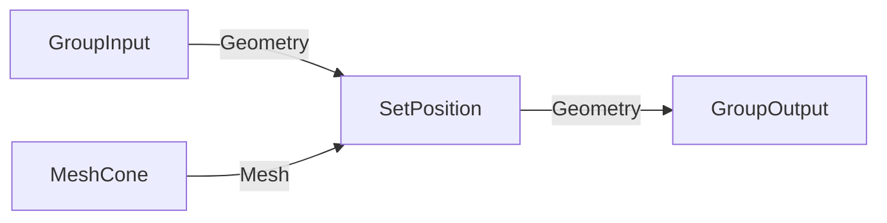

# Geometry Nodes MCP Workflow

This project provides tools for creating and validating Blender Geometry Nodes via Claude Code, ChatGPT Pro, RooCode, Cline, or any LLM tool with Blender MCP access.

## Quick Start

At the start of any geometry nodes session, load the portable toolkit:

```python
exec(open("/Users/alexanderporter/Documents/_DEV/Geo Nodes MCP/toolkit.py").read())
```

This loads all functions into Blender's Python environment.

## Workflow Options

### Option 1: Mermaid → Blender (Recommended for Complex Graphs)

Plan in Mermaid first, then build:

```python
mermaid_graph = '''
flowchart LR
  gi["GroupInput"] -->|Instance| n3["InstanceOnPoints"]
  n1["MeshGrid"] -->|Mesh| n2["MeshToPoints"]
  n2 -->|Points| n3
  n4["MeshCone"] -->|Mesh| n3
  n3 -->|Geometry| go["GroupOutput"]
'''

result = mermaid_to_blender("MyObject", "MyModifier", mermaid_graph,
    node_settings={"n1": {"Size X": 10}, "n4": {"Depth": 0.5}})
```

### Option 2: graph_json (Precise Control)

Build from explicit JSON specification:

```python
graph_json = {
    "nodes": [
        {"id": "group_in", "type": "NodeGroupInput"},
        {"id": "grid", "type": "GeometryNodeMeshGrid"},
        {"id": "instance", "type": "GeometryNodeInstanceOnPoints"},
        {"id": "group_out", "type": "NodeGroupOutput"}
    ],
    "links": [
        {"from": "group_in", "from_socket": "Geometry", "to": "instance", "to_socket": "Instance"},
        {"from": "grid", "from_socket": "Mesh", "to": "instance", "to_socket": "Points"},
        {"from": "instance", "from_socket": "Instances", "to": "group_out", "to_socket": "Geometry"}
    ],
    "node_settings": {"grid": {"Size X": 10}}
}
result = build_graph_from_json("MyObject", "MyModifier", graph_json)
```

### Option 3: Manual with Safe Helpers

For fine-grained control:

```python
# Get socket by TYPE (not index!)
vector_out = get_output_by_type(random_node, 'VECTOR')

# Validate links immediately
safe_link(node_group, from_socket, to_socket)  # Raises if invalid
```

## Always Validate

After building, always validate:

```python
result = full_geo_nodes_validation("ObjectName", "ModifierName")
print_validation_report(result)

# result contains:
# - status: "VALID" or "ISSUES_FOUND" or "ERROR"
# - graph: {node_count, link_count, invalid_links, issues}
# - metrics: {vertex_count, min_z, max_z, ground_contact}
# - issues: [list of all problems]
# - screenshot_path: path to workspace screenshot
```

## Reference Data

### Node Catalogue
- **Complete:** `reference/geometry_nodes_complete_4_4.json` (257 nodes)
- **Minimal:** `geometry_nodes_min_4_4.json` (202 nodes, GeometryNode* only)
- **Version:** Blender 4.4
- **Contains:** Node definitions with inputs/outputs, socket types, categories

### Socket Compatibility
- **File:** `socket_compat.csv`
- **Contains:** 58 allowed socket type pairs for link validation

**Important:** If using a different Blender version, socket names may differ. Run `check_catalogue_version("4.4")` to verify compatibility.

## Available Functions

### Building
| Function | Purpose |
|----------|---------|
| `mermaid_to_blender(obj, mod, mermaid)` | One-step: Mermaid → Blender |
| `parse_mermaid_to_graph_json(mermaid)` | Convert Mermaid to graph_json |
| `build_graph_from_json(obj, mod, json)` | Build from JSON spec |
| `set_node_input(node, name, value)` | Set input default value |
| `safe_link(ng, from_sock, to_sock)` | Create validated link |

### Socket Helpers
| Function | Purpose |
|----------|---------|
| `get_output_by_type(node, type)` | Find output by socket type |
| `get_input_by_type(node, type)` | Find input by socket type |
| `get_output_by_name(node, name)` | Find output by name |
| `get_input_by_name(node, name)` | Find input by name |

### Validation
| Function | Purpose |
|----------|---------|
| `full_geo_nodes_validation(obj, mod)` | Complete validation + screenshot |
| `validate_graph_structure(node_group)` | Check for invalid links |
| `validate_geometry_metrics(obj)` | Check bounds, ground contact |
| `print_validation_report(result)` | Pretty-print validation result |

### Visual
| Function | Purpose |
|----------|---------|
| `capture_node_graph(obj, mod)` | Fullscreen node graph screenshot |
| `switch_to_mcp_workspace()` | Switch to validation workspace |
| `configure_validation_views(obj, mod)` | Set up viewports |

### Utilities
| Function | Purpose |
|----------|---------|
| `list_available_nodes()` | List all geo node types |
| `inspect_node_sockets(type)` | Show node's inputs/outputs |
| `layout_nodes(node_group)` | Auto-layout nodes |
| `check_catalogue_version(ver)` | Verify Blender version match |

## Common Mistakes to Avoid

1. **Wrong socket index:** Use `get_output_by_type()` instead of `outputs[2]`
2. **Invalid links:** Always use `safe_link()` or check `link.is_valid`
3. **Local Space on transforms:** Explicitly set `Local Space = False` for world-space translation
4. **Visual-only validation:** Always run numerical checks, don't trust screenshots alone
5. **Unchecked defaults:** Audit node parameters after creation
6. **Mismatched socket names:** Output "Mesh" may go to input "Instance" - use graph_json for precision

## Mermaid Conventions

When using Mermaid for planning:



+ Use `flowchart LR` (left-to-right)
+ Node syntax: `n1["Label"]` with double quotes. Avoid parentheses in labels—they confuse Mermaid's parser.
- Edge label = output socket name: `-->|Mesh|`
- Use short labels (MeshCone) or full types (GeometryNodeMeshCone)
- Always include `GroupInput` and `GroupOutput` nodes in the plan so the builder knows how the graph interfaces with the modifier.

## Regenerating the Catalogue

If using a new Blender version:

1. Open Blender with the target version
2. Run `GeoNodes_Exporter_Complete.py` in Blender's scripting workspace
3. Output saved to `~/Downloads/geometry_nodes_complete_X_X.json`
4. Copy to `reference/` folder

## Files

```
toolkit.py                              # Portable single-file toolkit
GUIDE.md                                # This documentation

geo_nodes_mcp/                          # Module version (same functions)
├── __init__.py
├── loader.py
├── builder.py
├── validator.py
└── workspace.py

reference/
└── geometry_nodes_complete_4_4.json    # Full catalogue (257 nodes)

GeoNodes_Exporter_Complete.py           # Catalogue generator script
geometry_nodes_min_4_4.json             # Original minimal catalogue
socket_compat.csv                       # Socket compatibility matrix
```

## Project Notes

**Recent work**
- Added catalogue + socket-compat loaders shared by toolkit & package
- Enforced pre-link socket validation (direction + type)
- Began scaffolding field-awareness (requires refreshed catalogue data)
- Updated Mermaid/graph_json docs to always include GroupInput/GroupOutput

**Next steps**
1. Refresh catalogue export so `supports_field` flags reflect Blender truth
2. Use catalogue metadata to validate node settings (enum/mode properties)
3. Automate the LLM checklist (Rules 1‑22) so MCP can fail fast before building
4. Document how to annotate Mermaid nodes with key parameter hints for human review
5. Add a "full fat" graph report generator that lists each node's sockets,
   the specific inputs/outputs used, their values, and data flowing through
   each wire for manual reconstruction when needed.
6. Run validation smoke tests via Blender MCP (Mermaid → graph_json → build →
   `full_geo_nodes_validation`) to verify socket checks and catalogue loaders.
