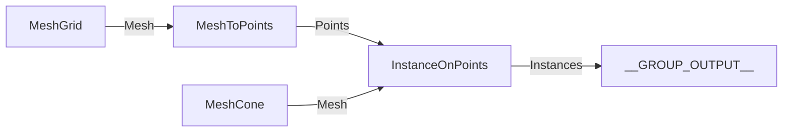

# Blender Geometry Nodes MCP Toolkit

**Enable LLMs to programmatically create Blender Geometry Node graphs via a declarative JSON/Mermaid interface.**

The toolkit bridges how LLMs naturally describe things (structured text, diagrams) and Blender's imperative node API — acting as a compiler from intent to implementation.

### Core Capabilities

- **Incremental API** — Build nodes one at a time with `add_node()` and `auto_link()`. Each statement validates immediately. Supports aliases ("scatter", "instance") and auto-detects compatible sockets. Use `describe_node_group()` for instant state feedback.
- **Declarative graph building** — Define node graphs as JSON (`graph_json`) or Mermaid flowcharts, then execute in Blender without writing imperative Python.
- **Preflight validation** — Catch errors (unknown node types, bad socket names, type mismatches) *before* touching Blender, giving fast feedback to LLMs.
- **Incremental updates** — Diff existing graphs against desired state; add/update/remove only what changed.
- **Node catalogue** — JSON reference of all Geometry Node types with inputs/outputs/socket types, enabling validation without Blender running.

### Target Users

- **Primary:** LLM agents (Claude, GPT, etc.) via MCP that `exec()` the toolkit in Blender
- **Secondary:** Developers building procedural geometry tools or automation scripts

**Key ideas**
- Plan visually: sketch Mermaid flow charts (with GroupInput/GroupOutput) so
  humans can sanity-check topology before executing anything.
- Catalog-driven safety: builders load Blender 5.0 node definitions and the
  socket compatibility matrix before linking, catching wrong directions or
  types early.
- Pre-flight validation: `build_graph_from_json()` now runs a fail-fast
  preflight checklist (node types, sockets, Group Output linkage, setting
  types) before touching Blender.
- Incremental merge support: set `merge_existing=True` to diff against existing
  graphs by JSON node ID, update settings, and rewire links without a full
  rebuild. Optional `remove_extras=True` removes nodes/links not in the JSON;
  the build result includes a `diff_summary` of changes.
- Full graph reporting: optional “full report” dumps nodes, sockets, defaults,
  and links to aid manual reconstruction when automation fails. You can pass
  `last_graph_json` and `last_diff_summary` to include recent merge context.
- Incremental build loop: use `add_node`, `auto_link`, and `describe_node_group` to add nodes one at a time, inspect the state, and fix issues before running expensive validation. Only run the MCP validation payload once describe_node_group reports no warnings.

## Getting Started
1. Open Blender 5.0+ and run:
   ```python
   exec(open("/Users/alexanderporter/Documents/_DEV/Geo Nodes MCP/toolkit.py").read())
   ```
   This loads all helpers (Mermaid parsing, graph builders, validators) into the
   current Python session.
2. Plan graphs in Mermaid or `graph_json`, then call
   `mermaid_to_blender()` or `build_graph_from_json()` to instantiate the node
group. For incremental updates, call `build_graph_from_json(...,
merge_existing=True, remove_extras=True)` to diff and merge by node ID.
3. Run `full_geo_nodes_validation()` to capture screenshots and structural/
   metric reports. Pass `include_report=True` to include a full graph report.

## Catalogue Snapshot (Blender 5.0)
- **version_string:** 5.0.1
- **build_hash:** a3db93c5b259
- **build_date:** 2025-12-16
- **Complete catalogue:** `reference/geometry_nodes_complete_5_0.json`
- **Minimal catalogue:** `reference/geometry_nodes_min_5_0.json`
- **Socket compatibility:** `reference/socket_compat_5_0.csv`
- **Manual metadata extras:** `reference/node_metadata_extras.json` (descriptions scraped from the Blender manual to fill gaps in the catalogue)


## Documentation
- `GUIDE.md` – Hands-on quick start, helper catalog, project notes, and common
  pitfalls.
- `WORKFLOW.md` – MCP-centric process covering Mermaid rules, response format,
  and the 22-step checklist the LLM must satisfy before building.
- `reference/` – Blender 5.0 catalogue JSON and socket compatibility CSV (the
  files loader utilities rely on).

## Repository Layout
- `toolkit.py` – Single-file toolkit, the source of truth. Exec'd inside Blender.
- `reference/` – Node catalogues (4.4, 5.0) and socket compatibility CSVs.
  To generate catalogues for other Blender versions, run
  `GeoNodes_Exporter_Complete.py` inside the target Blender.
  To refresh manual metadata, run `python scripts/extract_manual_metadata.py` after updating the `_archive/blender-manual-gn` checkout.
- `scripts/` – Smoke tests and utility scripts.
  - `scripts/query_node_metadata.py` – quick lookup for node descriptions, sockets, and properties using the catalogue + manual extras.
- `_archive/` – Legacy assets (ignored by git).

## Contributing / Next Steps
High-level roadmap items live near the end of `GUIDE.md`. Briefly:
1. Regenerate catalogues so `supports_field` flags are accurate for field-aware
   validation (exporter now captures runtime values; refresh the catalogue to
   apply).
2. Expand node-setting validation using catalogue metadata (enum/mode rules).
3. Automate the LLM checklist in code so MCP workflows can fail fast before
   building.

## Status at a Glance
**Works today**
- Catalogue/socket loaders, Mermaid→graph_json parsing, graph builders, and
  validation helpers (`toolkit.py`).
- Pre-link safety checks (direction/type) using Blender 5.0 metadata.
- ✅ **MCP smoke tests pass (Blender 5.0)** (2026-01-29): graph_json workflow
  builds nodes, connects to Group Output, and validates under the 5.0 catalogue.

**Still to build/validate**
- Field-aware validation is now active using refreshed catalogue data (check
  graph_json links for field compatibility).
- Catalogue-driven node-setting validation (enum/mode properties).
- Automated enforcement of the 22-step LLM checklist.
- Extend the full graph report with per-link data payloads once the exporter
  captures them.

## Testing

### Unit Tests (no Blender required)

```bash
pytest tests/ -v
```

126 tests cover catalogue loading, preflight validation, Mermaid parsing, diff/merge logic, frames, and the incremental API — all via bpy mocks.

### Smoke Tests (in Blender)

**MCP-first (recommended)**: Copy contents of `mcp_smoke_test_payload.py` into
your MCP `execute_blender_code` call. This validates the full chain:
`graph_json → build → validation`.

**Targeted field-mismatch test (MCP)**: Copy
`scripts/field_mismatch_test_payload.py` into `execute_blender_code`. It should
fail with a field-compatibility error, confirming the guard is active.

**Merge-mode smoke test (MCP)**: Copy
`scripts/merge_smoke_test_payload.py` into `execute_blender_code` to verify
incremental merge/diff behavior and diff summaries.

**Standalone Blender**: `blender --background --python smoke_test_mermaid.py`

Both tests verify:
1. Toolkit loads correctly
2. Nodes and links build without errors
3. Group Output is properly connected (critical!)
4. Validation pipeline returns `"status": "VALID"`

### Using `__GROUP_OUTPUT__` in Mermaid

To connect your graph to the modifier's output, use the special ID
`__GROUP_OUTPUT__` (with underscores) in your Mermaid plan:



The parser automatically maps socket names (e.g., `Instances` → `Geometry`).
