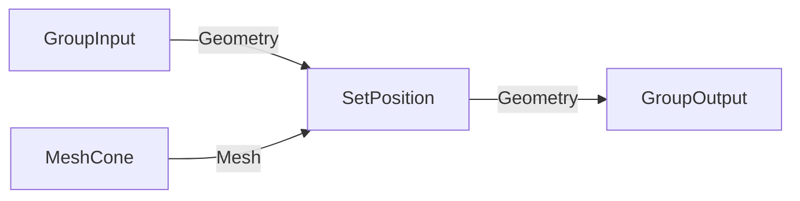

# LLM‑DRIVEN GEOMETRY‑NODES WORKFLOW — v3‑MERMAID

## ASSETS YOU LOAD IN MEMORY
- **geometry_nodes_min_4_4.json**  
  Lean catalogue: `identifier`, sockets (name, idname, is_output, supports_field), category.  
- **socket_compat.csv**  
  Allowed socket‑type pairs (generated once).

---

## PIPELINE (MCP‑centric)

1. **User brief** → e.g. “Scatter cones on a grid and randomise scale.”  
2. **Mermaid flowchart** (left→right) drafted by the LLM to sketch logic.  
3. **graph_json** generated from the diagram (nodes, links, node_settings).  
4. **LLM checklist self‑validation** using the catalogue + CSV.  
5. When `status = GRAPH_OK`, MCP builds the node tree inside Blender  
   (no `.blend` file required unless another tool needs one).

---

## MERMAID SKETCH RULES (keep syntax simple)

| Rule | Rationale |
|------|-----------|
| `flowchart LR` only | left→right means output→input direction |
| Node syntax | Use `n1["MeshCone"]` with double quotes. Avoid parentheses entirely—they often break Mermaid routing; full Blender type can be preserved in a `%% comment` or later JSON. |
| Edge label = socket name | e.g. `n1 --> |Mesh| n2` |
| Unique IDs (`n1`, `n2` …) | ensures clean mapping to JSON |
| Include IO nodes | Always sketch `GroupInput` and `GroupOutput` so modifier interfaces stay explicit. |

**Example sketch**



## Corresponding graph_json

```json
{
  "nodes":[
    {"id":"gi","type":"NodeGroupInput"},
    {"id":"n1","type":"GeometryNodeMeshCone"},
    {"id":"n2","type":"GeometryNodeSetPosition"},
    {"id":"go","type":"NodeGroupOutput"}
  ],
  "links":[
    {"from":"gi","socket":"Geometry","to":"n2","socket":"Geometry"},
    {"from":"n1","socket":"Mesh","to":"n2","socket":"Geometry"},
    {"from":"n2","socket":"Geometry","to":"go","socket":"Geometry"}
  ],
  "node_settings":{
    "n1":{"Vertices":32},
    "n2":{"Offset":[0,0,1]}
  }
}
```

## PROMPT STRUCTURE FOR THE LLM
  1.  CATALOGUE → insert only relevant node rows for this task.
  2.  COMPAT_RULE → identical idnames OK; Float ↔ Int ↔ Bool;
Geometry ↔ Geometry; Vector ↔ Vector; otherwise use socket_compat.csv.

### Instructions
A. Sketch the solution in Mermaid (flowchart LR).
B. Convert the diagram to graph_json.
C. Run the checklist; fix JSON until it passes.
D. Reply exactly in YAML‑ish form:

```yaml
mermaid_code: |
  (flowchart here)
graph_json: |
  { … }
status: GRAPH_OK | ERRORS_FOUND
errors: [ list ]      # empty if GRAPH_OK
```

## CHECKLIST (LLM MUST PASS BEFORE status = GRAPH_OK)
  1.  Every node.type exists in CATALOGUE.
  2.  For each link:
  • source & target IDs exist.
  • source socket → node.outputs && is_output = true.
  • target socket → node.inputs  && is_output = false.
  • (src.idname, dst.idname) appears in socket_compat.csv.
  3.  No duplicate node IDs or links.
  4.  Required inputs without defaults get a link or an explicit value.
  5. **Node‑ID correctness**  
   - Resolve identifiers with `python3 scripts/query_node_metadata.py --node "<label>"` (or `--search <term>`). Blender 5.x often exposes math/utility helpers as `ShaderNode*` even inside Geometry Nodes (e.g., Math, Combine/Separate, Noise Texture). Use the identifier returned by the metadata CLI/alias map; do **not** invent `FunctionNode*` names that aren’t in the catalogue.

  6. **Group Input / Output sockets**  
     - Before linking, add required IO sockets explicitly:  
       ```python
       node_group.inputs.new('NodeSocketGeometry', 'Geometry')
       node_group.outputs.new('NodeSocketGeometry', 'Geometry')
       ```  
     - Reference them by **name**, *not* by numeric index.

  7. **Always address sockets by name**  
     - `node.inputs['Geometry']`, `node.outputs['Instances']` — never `inputs[0]` or `outputs[1]`, which are unstable across Blender versions.

  8. **Direction guard in code as well**  
     - The builder must raise if `src.is_output == False` *or* `dst.is_output == True` before calling `links.new()`.

  9. **Type‑mismatch remediation**  
     - If the planned link fails the compat check **but base types differ only in dimensionality** (e.g. Float→Vector), auto‑insert a helper node:  
       •`Combine XYZ` for Float→Vector.  
       •`Separate XYZ` for Vector→Float.  
       •`Euler to Rotation` or `Align Euler to Vector` for Float/Vector→Rotation.

  10. **Scalar rotation & scale guidelines**  
      - *Scale* socket accepts **Float** (uniform) or **Vector** (XYZ).  
      - *Rotation* socket accepts **Vector (Euler)** or **Quaternion** — never plain Float.  
      - If only a scalar driver is available, convert via `Combine XYZ` into an Euler vector.

  11. **Material nodes belong in `mat.node_tree`, not the Geometry node group**  
      - Keep shader construction separate; MCP should attach materials after the Geo‑node graph is complete.

  12. **Optional self‑review step**  
      - After building the node tree, iterate over `group.links` and print `from_node.name → to_node.name` as a final sanity echo before returning success to MCP.
  13. *Never* rely on Blender’s modifier to create a fresh node tree you will discard.
    - Get the auto‑tree via `geomod.node_group`; if you need a clean slate,
      call `node_group.nodes.clear()` instead of `bpy.data.node_groups.new()`.

  14. Socket names are version‑specific.  For Blender 4.4:
        - GeometryNodeSubdivideMesh → output **Geometry**
        - GeometryNodeMeshToPoints  → input **Geometry**, output **Points**
        - InstanceOnPoints          → input **Points**, **Instance**, *Scale* (Float), *Rotation* (Vector)

  15. No Shader‑tree nodes inside Geometry‑node graphs.  
      Remove any fallback to `ShaderNode*`; raise an error if the intended
      `FunctionNode*` idname is missing.

  16. Always clear unused modifier‑generated groups to avoid “empty tree”
      warnings.

  17. Target *Rotation* with a **Vector (Euler)**; build it with
      `FunctionNodeCombineXYZ` (idname) and link by name.

  18. **Refresh group reference after destructive ops**  
    If you call any function that can delete or replace the node tree  
    (`node_group.nodes.clear()`, `bpy.data.node_groups.remove(…)`, etc.)  
    reacquire a fresh pointer before continuing:  
    ```python
    node_group = geomod.node_group
    ```

  19. **Step‑by‑step linking & validation**  
      Add one node and one link at a time; immediately verify:  
      ```python
      link = node_group.links.new(out_sock, in_sock)
      assert link.is_valid, "Invalid link created"
      ```  
      This surfaces socket‑name typos or direction errors early.

  20. **Runtime socket‑name checks during development**  
      ```python
      if "Geometry" not in n2.outputs:
          raise KeyError("SubdivideMesh output 'Geometry' not found")
      if "Scale" not in n4.inputs:
          raise KeyError("InstanceOnPoints missing 'Scale' input")
      ```  
      Explicit guards prevent silent failures when Blender renames sockets in future versions.

  21. **Socket‑compatibility test is mandatory, not optional**  
    - For every link, look up `(src.idname, dst.idname)` in `socket_compat.csv`.  
    - If the pair is missing, insert the required conversion node *or* raise an error; never skip the check.

  22. **Iterative checklist loop**  
    1. Build / update the graph.  
    2. Run the **entire** checklist (Rules 1‑21).  
    3. If any item fails → log the issues, fix them, **then restart from Step 1**.  
       Do **not** exit early or assume prior items remain valid after fixes.  
    4. Only when all rules pass in a single run may you emit `status: GRAPH_OK`.  

If any rule fails → status: ERRORS_FOUND + list issues; else GRAPH_OK.

## MCP ACTION AFTER GRAPH_OK
Feed graph_json to your MCP builder to instantiate the node tree.
Optionally run a headless-Blender validator for extra certainty.

## Visual Organization Best Practices

- **Use frames to group related logic.** Add a `frames` array to `graph_json` so downstream tools can place Blender `NodeFrame` containers automatically:

```json
  "frames": [
    {
      "id": "inputs",
      "label": "Mesh Inputs",
      "color": [0.2, 0.4, 0.8, 0.8],
      "nodes": ["grid", "mesh_to_points"],
      "text": "Base geometry before instancing"
    }
  ]
```

- **Re-use `auto_frame_graph()`.** The toolkit exposes `auto_frame_graph(node_group, strategy="connectivity"|"type", apply=False)` to suggest sensible frames for an existing build. Capture its output, edit the labels/colors, then include the result in graph_json.
- **Color-code consistently.** Pick one palette (inputs=blue, transforms=green, outputs=orange, math=purple) so humans can scan LLM-generated graphs quickly.
- **Keep frames concise.** Split large graphs into multiple frames or nested groups once you exceed ~10 nodes per frame; clutter defeats the purpose.
- **Document intent.** Populate the optional `text` field (stored as a custom property) to explain non-obvious math or attribute tricks—critical for human-in-the-loop review.
- **Expose modifier controls near the frame.** When you add Group Input sockets for parameters (e.g., “Leaf Length”), park the input node inside the related frame so the interface and implementation stay synchronized.
- **Note on validation:** Current frame support has unit coverage, but a live Blender validation pass is still pending. Keep an eye on layout quirks after MCP builds until that manual verification is complete.

### Node Discovery Helpers (new)
- Use `get_node_metadata("GeometryNodeMeshToPoints")` to surface the catalogue label/category/description for any identifier. The metadata mirrors Blender’s manual, so you can quote it directly when explaining tweaks.
- Call `find_nodes_by_keyword("scatter")` (limited list) to search labels/descriptions for a phrase when the exact node name isn’t obvious. This helps map “flip normals” → Align Euler, or “switch between meshes” → Switch node, without guessing.

### Utility / Meta Nodes Guidance
- **Repeat Zone / Simulation Zone:** Reach for these when you need loops or stateful simulation. Remember to wire the “Repeat Output” or “Simulation Output” back into the main flow. Document the intent in a frame.
- **Switch / Bundle / Reroute:** Use Switch for conditional flows (e.g., low/high LOD). Bundle sockets keep related wires clean—mirror the manual grouping (“Bundle > Geometry”) so humans can follow.
- **Warning and Note nodes:** `GeometryNodeWarning` lets you surface runtime guidance. Include a brief “LLM TODO” message so users know what to inspect.
- **Procedural utilities (Closures, Bag, etc.)** live under Add > Utilities. Mention the menu path when instructing manual tweaks: e.g., “Add > Utilities > Switch”. The catalogue’s `category` helps you cite the right section even if the UI differs between Blender versions.
