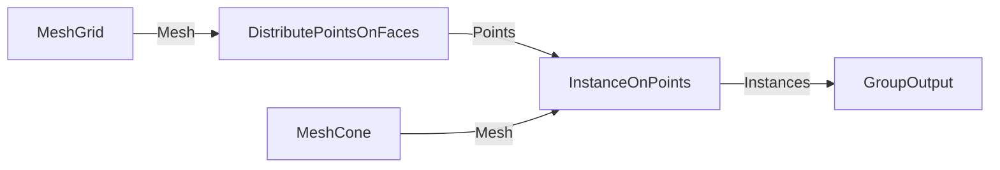
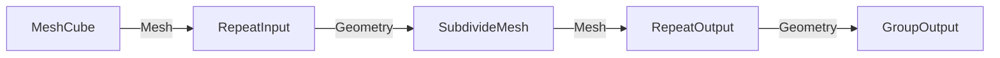
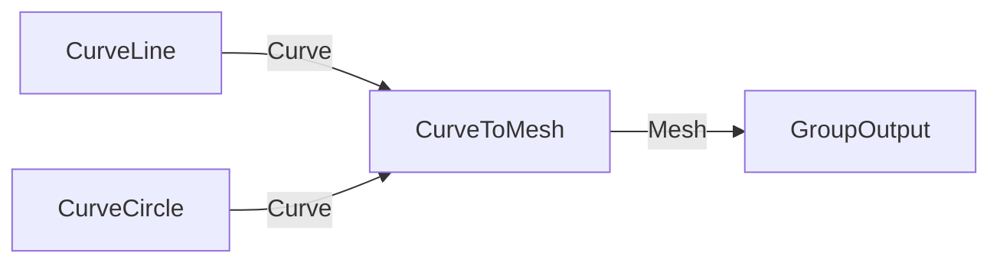

# Node Patterns & Quirks Reference

> **Purpose:** Common geometry node patterns with sample code, and a list of nodes that require special handling.

---

## Common Patterns

### Scatter Points on Surface

Distribute points randomly on a mesh surface, then instance objects at those points.



```json
{
  "nodes": [
    {"id": "grid", "type": "GeometryNodeMeshGrid"},
    {"id": "distribute", "type": "GeometryNodeDistributePointsOnFaces"},
    {"id": "cone", "type": "GeometryNodeMeshCone"},
    {"id": "instance", "type": "GeometryNodeInstanceOnPoints"}
  ],
  "links": [
    {"from": "grid", "from_socket": "Mesh", "to": "distribute", "to_socket": "Mesh"},
    {"from": "distribute", "from_socket": "Points", "to": "instance", "to_socket": "Points"},
    {"from": "cone", "from_socket": "Mesh", "to": "instance", "to_socket": "Instance"},
    {"from": "instance", "from_socket": "Instances", "to": "__GROUP_OUTPUT__", "to_socket": "Geometry"}
  ]
}
```

**Quirk:** Apply `distribute` settings (Density, Distance Min) in a separate MCP call after building.

---

### Randomize Transform

Add random scale/rotation to instances using Random Value nodes.

```json
{
  "nodes": [
    {"id": "random_scale", "type": "FunctionNodeRandomValue"},
    {"id": "random_rot", "type": "FunctionNodeRandomValue"},
    {"id": "instance", "type": "GeometryNodeInstanceOnPoints"}
  ],
  "node_settings": {
    "random_scale": {"data_type": "FLOAT", "Min": 0.5, "Max": 1.5},
    "random_rot": {"data_type": "FLOAT_VECTOR", "Min": [0, 0, 0], "Max": [0, 0, 6.28]}
  }
}
```

**Quirk:** Random Value outputs are **fields** by default in Blender 5.0. Set `data_type` explicitly to `FLOAT` or `FLOAT_VECTOR` if you need non-field output.

---

### Repeat Zone (Iteration)

Use Repeat Input/Output for iterative operations.



**Quirk:** Repeat zones require matching socket types on Input and Output. The toolkit doesn't yet auto-generate zone pairs — create them manually and link the internal geometry socket.

---

### Switch Between Geometries

Conditional output based on a boolean.

```json
{
  "nodes": [
    {"id": "switch", "type": "GeometryNodeSwitch"},
    {"id": "cube", "type": "GeometryNodeMeshCube"},
    {"id": "sphere", "type": "GeometryNodeMeshUVSphere"}
  ],
  "links": [
    {"from": "cube", "from_socket": "Mesh", "to": "switch", "to_socket": "False"},
    {"from": "sphere", "from_socket": "Mesh", "to": "switch", "to_socket": "True"},
    {"from": "switch", "from_socket": "Output", "to": "__GROUP_OUTPUT__", "to_socket": "Geometry"}
  ],
  "node_settings": {
    "switch": {"input_type": "GEOMETRY"}
  }
}
```

---

### Curve to Mesh

Create a mesh by sweeping a profile along a curve.



---

## Node Quirks

### Nodes Requiring Post-Build Settings

These nodes crash Blender 5.0.1 if their inputs are set during `build_graph_from_json()`. Apply settings in a separate MCP call.

| Node | Identifier | Problematic Inputs |
|------|------------|-------------------|
| Distribute Points on Faces | `GeometryNodeDistributePointsOnFaces` | Density, Distance Min, Density Max |

**Pattern:**
```python
# Step 1: Build without settings
build_graph_from_json(obj, mod, graph_json)  # No node_settings for distribute

# Step 2: Apply settings separately
node = node_group.nodes.get("distribute")
set_node_input(node, "Density Max", 10.0)
```

---

### Field vs Non-Field Sockets

Some sockets expect fields (per-point values), others expect single values.

| Node | Socket | Expects |
|------|--------|---------|
| Set Position | Offset | **Field** (Vector) |
| Instance on Points | Scale | Single Float or Vector |
| Instance on Points | Rotation | Single Vector (Euler) |

**Quirk:** Random Value in Blender 5.0 emits fields by default. To use with non-field inputs, either:
1. Set `data_type` to force non-field output
2. Use a Capture Attribute node to sample the field

---

### Math Nodes in Geometry Context

**Always use `FunctionNode*` prefixes**, never `ShaderNode*`:

| Task | Correct | Incorrect |
|------|---------|-----------|
| Float math | `FunctionNodeFloatMath` | `ShaderNodeMath` |
| Vector math | `FunctionNodeVectorMath` | `ShaderNodeVectorMath` |
| Combine XYZ | `FunctionNodeCombineXYZ` | `ShaderNodeCombineXYZ` |

The catalogue enforces this, but Mermaid labels might accidentally use shader prefixes.

---

### Frame Node Limitations

| Property | Limitation | Workaround |
|----------|------------|------------|
| `frame.text` | Requires Text datablock, not string | Store in `frame["description"]` custom property |
| `node.dimensions` | Not available until UI update | Use estimates: 150x150px |
| Containment | Bounds-based, not parenting | Use `node.parent = frame` for true parenting |

---

### Socket Name Variations by Version

Socket names can change between Blender versions. Always use the catalogue as the source of truth.

| Node | Blender 4.4 | Blender 5.0 |
|------|-------------|-------------|
| Mesh to Points | `Geometry` (in), `Points` (out) | Same |
| Subdivide Mesh | `Mesh` (out) | `Geometry` (out) |

**Solution:** Use `get_socket_spec(node_type, socket_name)` to verify socket existence before linking.

---

## Node Discovery

### Find Nodes by Keyword

```python
# Search labels and descriptions
results = find_nodes_by_keyword("scatter")
for node in results:
    print(f"{node['identifier']}: {node['label']}")
```

Common mappings:
- "scatter" → `GeometryNodeDistributePointsOnFaces`
- "flip normals" → `GeometryNodeFlipFaces`
- "switch" → `GeometryNodeSwitch`
- "repeat" → `GeometryNodeRepeatInput`, `GeometryNodeRepeatOutput`

### Get Node Metadata

```python
meta = get_node_metadata("GeometryNodeMeshToPoints")
print(meta["label"])       # "Mesh to Points"
print(meta["category"])    # "Mesh"
print(meta["description"]) # From Blender manual
```

---

## Visual Organization Tips

### Frame Groupings

Organize nodes into logical groups:

```json
{
  "frames": [
    {
      "id": "inputs",
      "label": "Input Generation",
      "color": [0.2, 0.4, 0.8, 1.0],
      "nodes": ["grid", "cone"],
      "text": "Base geometry before processing"
    },
    {
      "id": "processing",
      "label": "Scatter & Instance",
      "color": [0.2, 0.7, 0.4, 1.0],
      "nodes": ["distribute", "instance"],
      "text": "Point distribution and instancing pipeline"
    }
  ]
}
```

### Color Conventions

| Category | Suggested Color |
|----------|-----------------|
| Inputs (primitives, Group Input) | Blue `[0.2, 0.4, 0.8, 1.0]` |
| Processing (transforms, operations) | Green `[0.2, 0.7, 0.4, 1.0]` |
| Output (Group Output, final steps) | Orange `[0.8, 0.5, 0.2, 1.0]` |
| Math/Utilities | Purple `[0.7, 0.2, 0.7, 1.0]` |

### Auto-Framing

```python
# Group by connectivity (connected subgraphs)
frames = auto_frame_graph(node_group, strategy="connectivity")

# Group by node type prefix
frames = auto_frame_graph(node_group, strategy="type")

# Apply to node group
errors = []
_apply_frames(node_group, node_map, frames, errors)
```
